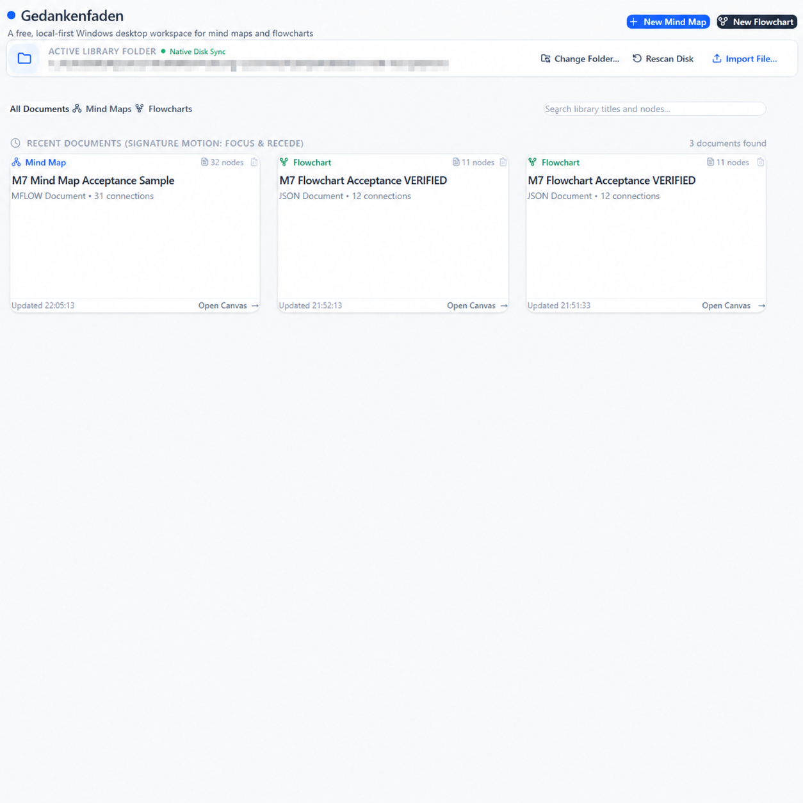
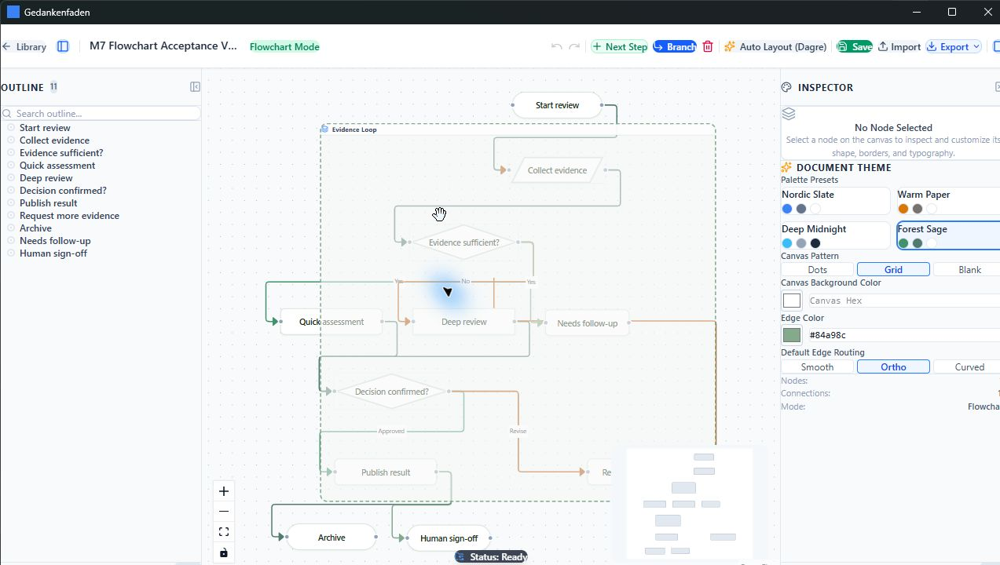

# Gedankenfaden — My Free Mindflow

A free, local-first Windows desktop workspace for building mind maps and flowcharts without accounts, cloud sync, or vendor lock-in.

[](https://github.com/Peter-S-Shi/Gedankenfaden--my-free-mindflow/actions/workflows/ci.yml)
[](https://github.com/Peter-S-Shi/Gedankenfaden--my-free-mindflow/releases/latest)
[](#download-and-run)
[](#local-first-by-design)

### Library



### Canvas



Gedankenfaden gives developers, researchers, technical writers, and systems thinkers one private canvas for hierarchical ideas and cyclic processes. The same canonical graph model powers both views, while files remain portable and user-owned.

## What you can do

- **Think in two structures.** Build balanced, collapsible mind maps or directed flowcharts with cycles, common diagram shapes, branch labels, groups, and multiple routing styles.
- **Work from the keyboard.** Create siblings, children, upstream or downstream nodes, edit labels, paste multiline outlines, and remove selections with desktop-native shortcuts.
- **Keep rich documents portable.** Store graph data and embedded images together in a single `.mflow` document.
- **Import existing outlines.** Turn Markdown or OPML hierarchies into editable documents while preserving the source file.
- **Share in practical formats.** Export canonical JSON, SVG, PNG, JPEG, PDF, Markdown, standalone HTML, Mermaid, OPML, FreeMind `.mm`, or JSON Canvas.

## A focused desktop workflow

```text
Library on your Windows folders
        ↓
Mind map or flowchart canvas
        ↓
Outline + direct manipulation + Inspector
        ↓
Atomic save, recovery journal, and local snapshots
        ↓
Portable .mflow or an open export format
```

The shortest useful path is simple: launch the app, create a mind map or flowchart, add a few connected ideas, and save the document directly to your own filesystem.

## Local-first by design

Gedankenfaden has no account system, tracking layer, mandatory network service, or cloud database. Its Library reflects real Windows folders, and document persistence uses debounced autosave, atomic writes, a crash-recovery journal, and bounded rolling snapshots.

This is a deliberate product boundary, not an offline mode layered onto a web service.

## Engineering highlights

- **Canonical graph boundary:** domain documents remain independent of React Flow; pure adapters project canonical nodes, edges, groups, and viewport state into the UI.
- **One model, two modes:** hierarchical mind maps and general directed flowcharts share a durable schema without pretending every graph can be losslessly converted through a user-facing mode switch.
- **Native file lifecycle:** Tauri 2 provides Windows filesystem access, native dialogs, file association, atomic persistence, and release packaging.
- **Data-integrity safeguards:** validation, transactional history, autosave, recovery, snapshots, and deletion confirmation protect the authoring loop.
- **Regression-oriented delivery:** TypeScript checks, unit and integration tests, production builds, native Windows builds, installer packaging, artifact verification, and native smoke checks run through the repository workflow.
- **Accessible motion:** interaction feedback respects `prefers-reduced-motion` rather than treating animation as a required cue.

For deeper inspection, see the [product contract](PRODUCT_SPEC.md), [architecture](ARCHITECTURE.md), [roadmap](ROADMAP.md), and [current verification status](PROJECT_STATUS.md).

## Download and run

Gedankenfaden v1.0.0 is available from [GitHub Releases](https://github.com/Peter-S-Shi/Gedankenfaden--my-free-mindflow/releases/latest):

- **NSIS installer** — conventional setup with Start Menu and desktop integration.
- **MSI package** — Windows Installer package with `.mflow` file association.
- **Portable ZIP** — extract and run `gedankenfaden.exe`; no installation required.
- **SHA-256 checksums** — supplied alongside the binaries.

The Windows binaries are currently unsigned, so Windows may show an unknown-publisher warning. The project does not target macOS, Linux, mobile, or a hosted web service in v1.

## Run from source

Prerequisites: Node.js 20.19 or newer, npm 10 or newer, and a stable Rust Windows toolchain.

```powershell
npm install
npm test
npm run build
npx tauri build --no-bundle
```

Launch the compiled native application with `start-gedankenfaden-rc.cmd`. For browser-only frontend development, use `start-gedankenfaden.cmd`.

## Intentional v1 boundaries

Gedankenfaden is a single-user Windows authoring tool. Version 1 does not include cloud sync, collaboration, accounts, AI map generation, mobile clients, presentation mode, a template marketplace, or social plugins.

## License

A license has not yet been selected. Until one is added, the source is publicly viewable but no reuse rights are granted by default.
