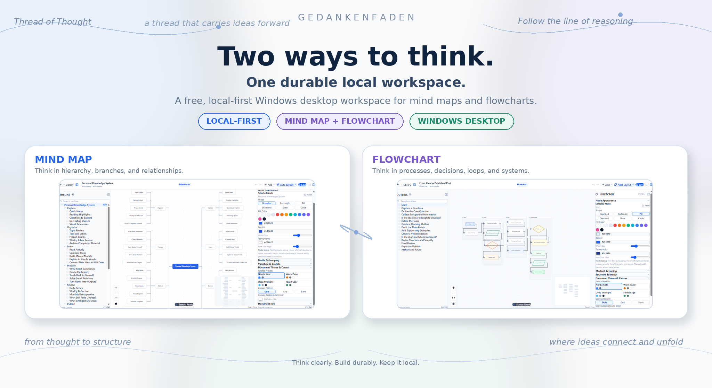
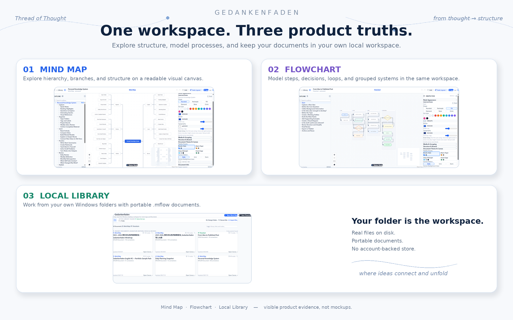
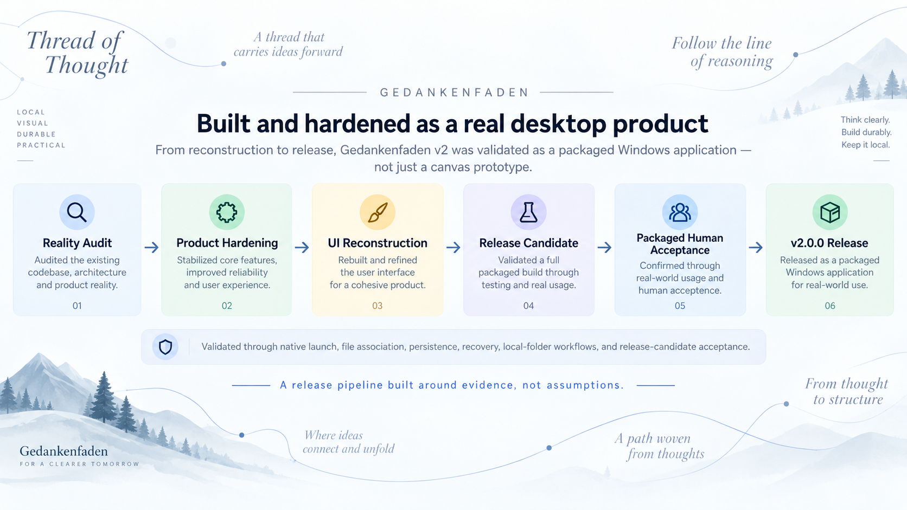

# Gedankenfaden

<p align="center">
  
</p>

<p align="center">
  <strong>A free, local-first Windows desktop workspace for mind maps and flowcharts.</strong>
</p>

<p align="center">
  No account. No mandatory cloud. Your documents stay on your own filesystem.
</p>

<p align="center">
  <a href="https://github.com/Peter-S-Shi/Gedankenfaden--my-free-mindflow/releases"><strong>Releases</strong></a>
  ·
  <a href="#see-it-in-action">See it in action</a>
  ·
  <a href="#engineering-depth">Engineering</a>
  ·
  <a href="ARCHITECTURE.md">Architecture</a>
</p>

<p align="center">
  <a href="https://github.com/Peter-S-Shi/Gedankenfaden--my-free-mindflow/actions/workflows/ci.yml"></a>
  <a href="https://github.com/Peter-S-Shi/Gedankenfaden--my-free-mindflow/releases"></a>
  
  
  
</p>

Gedankenfaden is built around a simple idea: visual thinking should not force you to choose between a hierarchy tool and a process tool — or between convenience and ownership.

Use **Mind Map** mode when you are exploring structure, branches, and relationships. Use **Flowchart** mode when you are modeling processes, decisions, loops, and systems. Both modes live on one canonical graph model, while your work remains stored as portable `.mflow` files on Windows.

---

## Why Gedankenfaden?

<table>
<tr>
<td width="33%" valign="top">

### 🧭 Two thinking modes

Move between a balanced, collapsible **Mind Map** and a directed **Flowchart** without switching products or abandoning one document model.

</td>
<td width="33%" valign="top">

### 💾 Real local ownership

The Library works with user-selected Windows folders. Documents are ordinary, portable files — not records trapped inside an account-backed cloud service.

</td>
<td width="33%" valign="top">

### 🛠️ Built beyond the demo stage

Persistence, autosave, crash recovery, file association, native packaging, export fidelity, regression coverage, and human release-candidate acceptance are part of the project.

</td>
</tr>
</table>

---

## See it in action

<p align="center">
  
</p>

### What you can do

- **Build structured mind maps** with balanced layouts, branch collapse/expand, cross-links, numbering, annotations, icons, and manual positioning.
- **Model real processes** with flowchart shapes, cycles, grouped nodes, labels, and orthogonal or smooth routing.
- **Work from the keyboard** to create siblings and children, edit labels, navigate selections, and turn multiline text into structure.
- **Keep documents portable** with `.mflow`, including the graph state and embedded assets needed to reopen the work later.
- **Import existing structure** from Markdown or OPML without replacing the source file.
- **Export to practical formats** including SVG, PNG, JPEG, PDF, Markdown, standalone HTML, Mermaid, OPML, FreeMind `.mm`, JSON, and JSON Canvas.
- **Recover from interruption** with autosave, snapshotting, and crash-recovery behavior designed for a real desktop workflow.

---

## One document, two representations

Gedankenfaden does not maintain separate products for mind mapping and flowcharting.

```text
Portable .mflow document
        │
        ▼
Canonical graph model
        │
        ├───────────────┐
        ▼               ▼
   Mind Map         Flowchart
 hierarchy          process
 exploration        logic
        │               │
        └───────┬───────┘
                ▼
      save / reopen / export
```

That separation matters technically: the durable domain document is not the canvas library itself. The UI projects canonical nodes, edges, groups, document metadata, and viewport state into the editor.

---

## Local-first by design

```text
Your Windows filesystem
        ↕
Gedankenfaden Library
        ↕
Portable .mflow documents
```

There is no account system, mandatory sync service, hosted database, or tracking layer in the core product model.

Local-first is not an offline fallback. It is the default ownership boundary.

---

## Engineering depth

Gedankenfaden is also an engineering portfolio project. The repository demonstrates the work required to turn a visual-editor prototype into a release-ready desktop product.

| Engineering area | What the project demonstrates |
|---|---|
| **Canonical graph architecture** | The domain model stays independent from the rendering library; adapters project canonical state into the editor. |
| **Dual-mode constraints** | Rooted Mind Maps and general directed Flowcharts share one representation while retaining mode-specific rules. |
| **Layout engineering** | Text-aware geometry, bilateral balancing, fan-out handling, manual-offset preservation, and incremental layout stability. |
| **Native desktop boundary** | Tauri + Rust filesystem integration, authorized paths, active-folder watching, file association, and native lifecycle handling. |
| **Persistence & recovery** | Atomic-style persistence, autosave, rolling recovery state, save/reopen journeys, and crash-recovery validation. |
| **Export fidelity** | Geometry and visual intent are preserved across vector, raster, document, and structured interchange formats. |
| **Release discipline** | Reality audit → hardening → UI reconstruction → release candidate → packaged human acceptance → v2.0.0. |

<p align="center">
  
</p>

For the deeper record, see:

- [`ARCHITECTURE.md`](ARCHITECTURE.md) — system architecture and domain boundaries
- [`ROADMAP.md`](ROADMAP.md) — milestone history and v2 closure
- [`PROJECT_STATUS.md`](PROJECT_STATUS.md) — current program and verification state
- [`.github/V2_DEFECT_LEDGER.md`](.github/V2_DEFECT_LEDGER.md) — historical hardening evidence

---

## Download

Get the newest published Windows build from the repository's [GitHub Releases](https://github.com/Peter-S-Shi/Gedankenfaden--my-free-mindflow/releases) page.

Windows delivery formats include:

- **NSIS installer** — conventional Windows setup
- **MSI package** — Windows Installer distribution
- **Portable ZIP** — extract and run without installation

The Windows binaries are currently unsigned, so Windows may display an unknown-publisher warning.

---

## Run from source

Prerequisites: Node.js 20.x, npm, and a stable Rust Windows toolchain.

```powershell
npm install
npm test
npm run build
npx tauri dev
```

Build the full Windows desktop bundle with:

```powershell
npx tauri build
```

---

## Intentional boundaries

Gedankenfaden v2 is deliberately scoped as a **single-user Windows visual-thinking tool**.

It does not currently include cloud sync, collaboration, user accounts, mobile clients, presentation mode, a template marketplace, or whole-map AI generation.

Those are product boundaries, not missing claims. The current design stays focused on private, durable, local visual thinking.

---

## Technology

<p>
  <strong>React 19</strong> ·
  <strong>TypeScript</strong> ·
  <strong>Tauri 2</strong> ·
  <strong>Rust</strong> ·
  <strong>@xyflow/react</strong> ·
  <strong>Vite</strong> ·
  <strong>Vitest</strong>
</p>

---

## Release status

**Current codebase:** `v2.0.0`

The v2 program completed product hardening, UI reconstruction, release-candidate validation, and packaged human acceptance. Published downloadable builds are listed on the Releases page.

---

## License

A license has not yet been selected. Until one is added, the source is publicly viewable but no reuse rights are granted by default.
